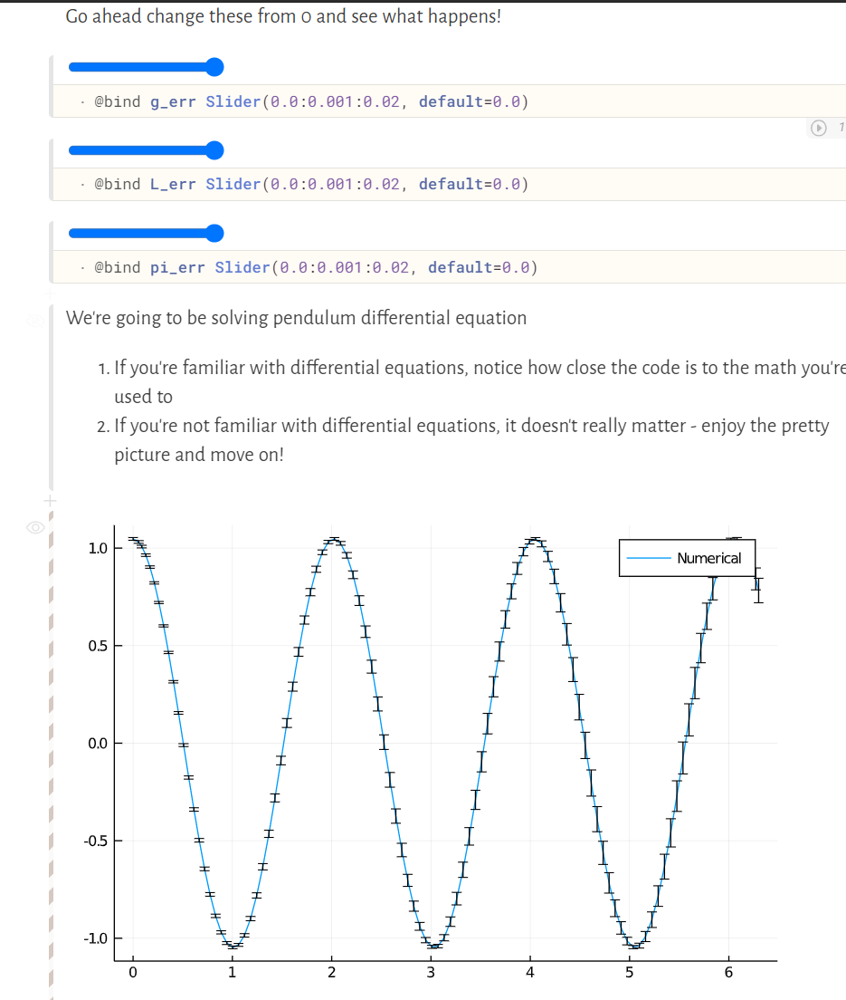

# How Multiple Dispatch lets you write Composable software

This is an interactive tutorial made in a Pluto.jl notebook

Multiple dispatch is arguably the definining feature of Julia which lets you write code which is as easy as Python but as fast as C. The goal of this tutorial is to show you just how powerful Multiple Dispatch is and why it's used in pretty much every single Julia library.

We'll be going over how Multiple Dispatch lets you write
1. Game/Physics Engines
2. Type Specialized Matrix Multiplication
3. Dealing with Uncertainty in packages that don't support uncertainty
4. Automatic Differentiation a Tweet long implementation

## Usage

### Run remotely (easiest way)
Click here https://mybinder.org/v2/gh/fonsp/pluto-on-binder/master?urlpath=pluto/open?url=https%3A%2F%2Fraw.githubusercontent.com%2Fmsaroufim%2Fmultiple_dispatch%2Fmaster%2Fsrc%2Fmultiple_dispatch.jl

### Run remotely
1. Go to https://pluto-on-binder.glitch.me/
2. Put in my notebook url https://github.com/msaroufim/multiple_dispatch/blob/master/src/multiple_dispatch.jl
3. Push enter and give it a a minute or two, loading the Julia libraries takes a while

### Run locally

1. using Pluto
2. Pluto.run(1234)
3. Navigate to ```localhost:1234``` in your browser and open up the file


One of the many pretty pictures in this article showing how you can get error bars for free in a differential equation solver that doesn't natively support uncertainty using multiple dispatch.


